# Домашнее задание
1. Сначала развернули виртуальную машину virtualbox. Скрин 1
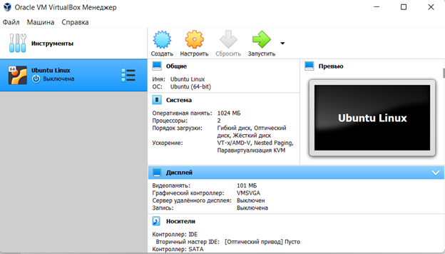
2. Склонировали виртуалку 2 раза, чтобы было 3 машины. 
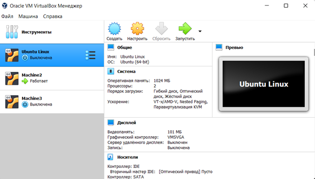
3. Переименуем хост и создадим нового пользователя.
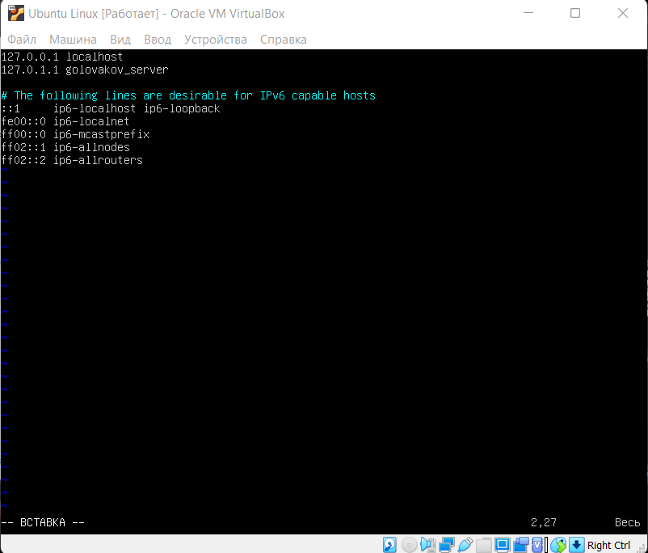
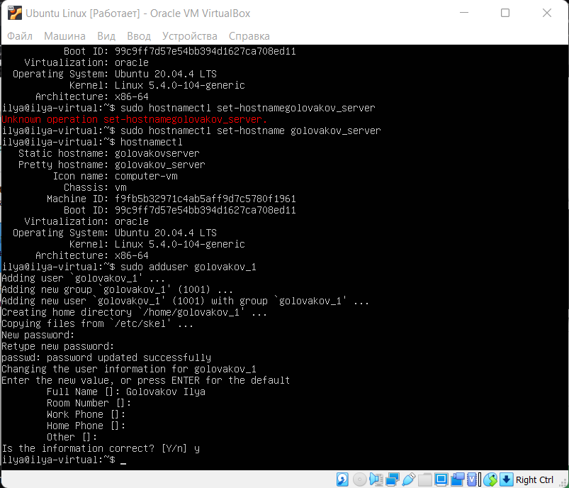
```shell 
$ sudo vim /etc/hostname
$ sudo adduser golovakov_1
```
4. Для других виртуалок то же самое. 


```shell 
$ sudo adduser golovakov_2
$ sudo adduser golovakov_3
```
5. Далее проводим настройку SSH.
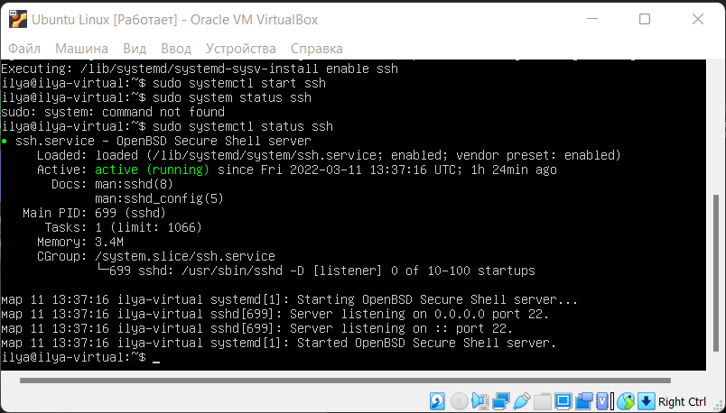
```shell 
$ sudo apt-get install ssh
$ sudo apt install openssh-server
$ sudo systemctl enable ssh
$ sudo apt install openssh-server -y
$ systemctl enable ssh
$ systemctl start ssh
$ system status ssh
```
6. Сделали это для всех машин.
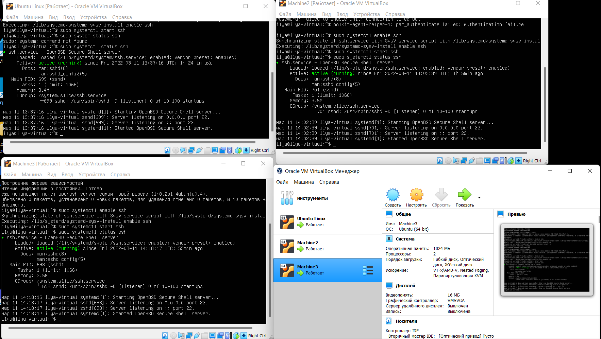
7. В терминале подключились к машинам.
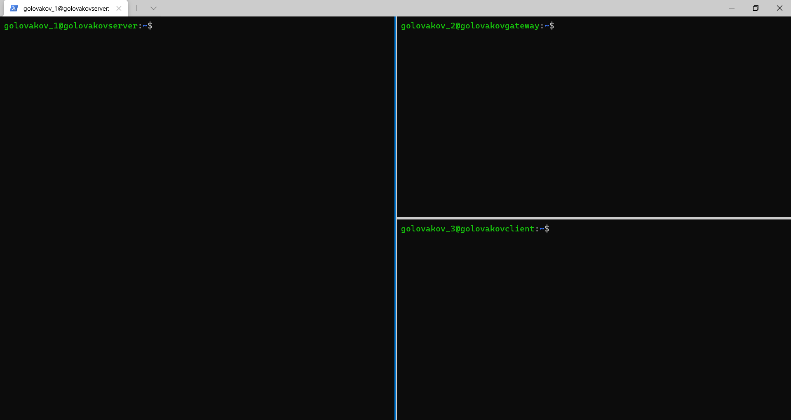
8. Провели настройку с помощью netplan.
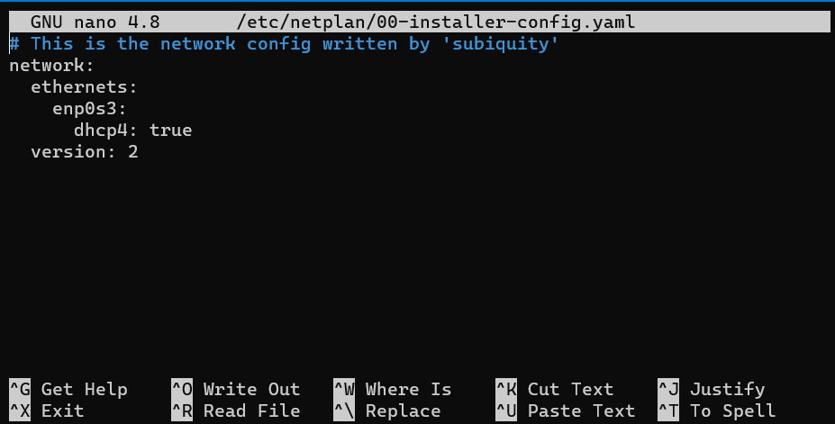
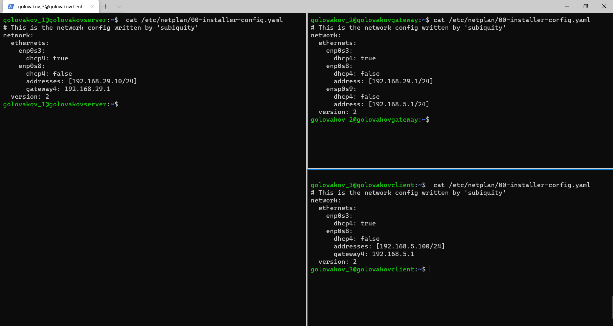
```shell 
$ sudo nano /etc/netplan/00-installer-config.yaml
```
9. Закрепили эти изменения.
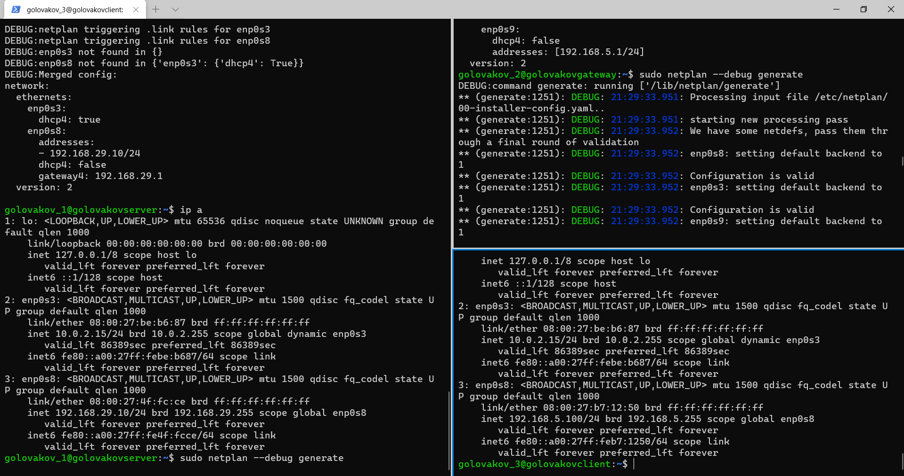
```shell
$ sudo netplan --debug generate
$ sudo netplan --debug apply
```
10. Сделаем так, чтобы виртуальные машины А и С могли видеть друг друга в сети 2.
```shell
$  echo 1 | sudo tee /proc/sys/net/ipv4/ip_forward 1
```
Также закрепим это для последующих перезапусков. Для этого надо перейти в файл /etc/sysctl.conf и раскомментировать строку "#net.ipv4.ip_forward=1".
```shell
$  sudo vim /etc/sysctl.conf
```
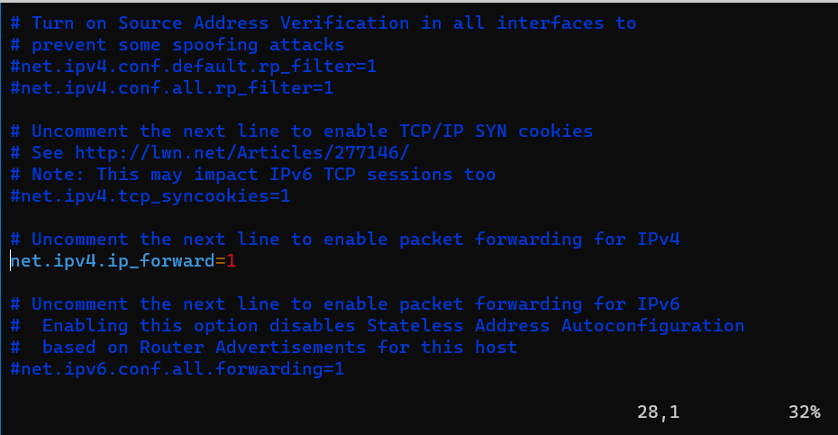
11. Пингуем сначала сервер-клиент.
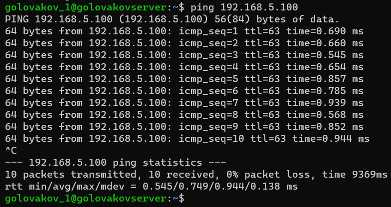
```shell
ping 192.168.5.100
```
12. Пингуем клиент-сервер. 
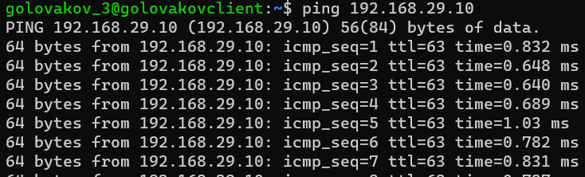
```shell
ping 192.168.29.10
```
13. Теперь разрешим переброс только конкретных пакетов по конкретному порту.
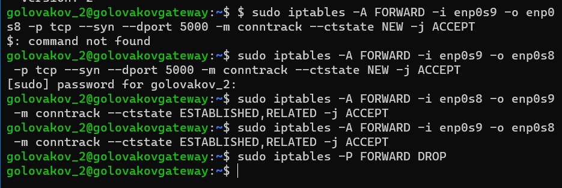
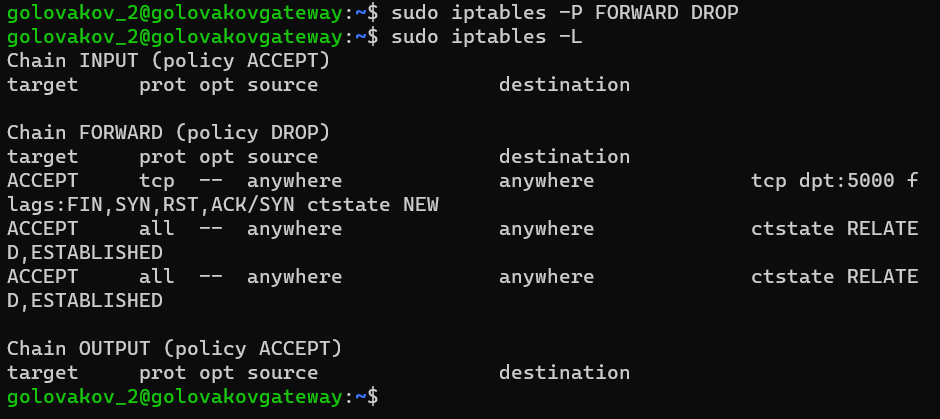
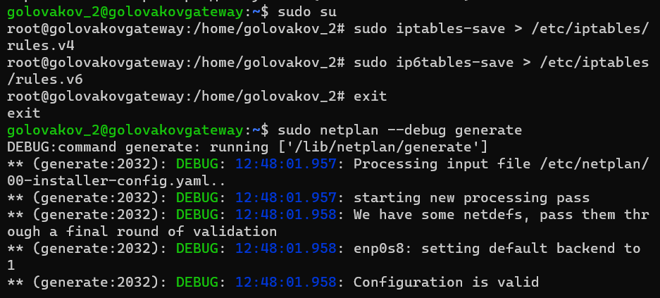
```shell
$ sudo iptables -A FORWARD -i enp0s9 -o enp0s8 -p tcp --syn --dport 5000 -m conntrack --ctstate NEW -j ACCEPT
$ sudo iptables -A FORWARD -i enp0s8 -o enp0s9 -m conntrack --ctstate ESTABLISHED,RELATED -j ACCEPT
$ sudo iptables -A FORWARD -i enp0s9 -o enp0s8 -m conntrack --ctstate ESTABLISHED,RELATED -j ACCEPT
$ sudo iptables -P FORWARD DROP
```
14. На языке python создаем сервер, чтобы получать от него информацию.
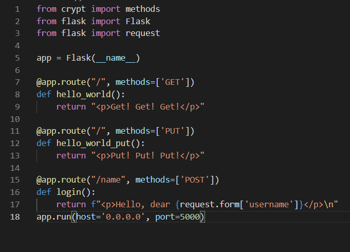
15. Настраиваем сервис, который запускает скрипт через автозагрузку.
```shell
$ sudo vim /lib/systemd/system/web-server.service
```
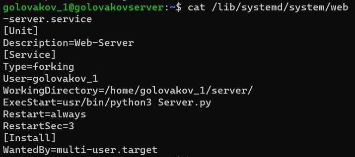
```shell
$ sudo systemctl daemon-reload
$ sudo systemctl start web-server
$ sudo systemctl enable web-server
$ sudo systemctl status web-server
```
16. Пытаемся связаться с этим сервером. Получаем ответ, значит всё успешно.
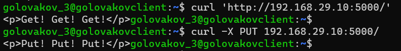
17. Проверим, что будет, если изменить порт на сервере.
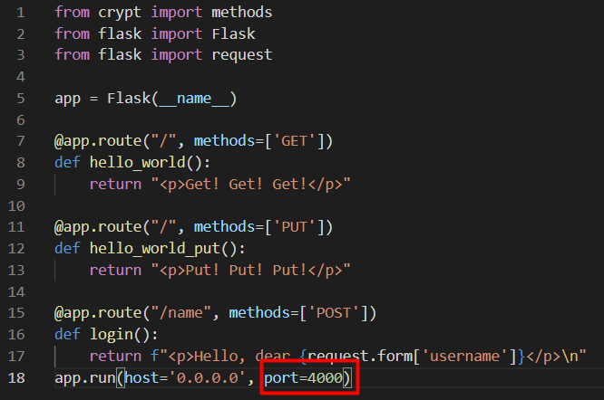
Отправим запрос и увидим, что ничего не получаем в ответ
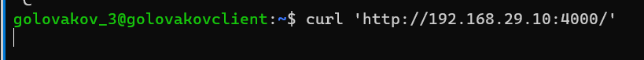

18. Отправим запрос с параметрами.
```shell
curl -X POST -d 'username=Ilya' http://192.168.29.10:5000/login
```
Получили ответ на запрос
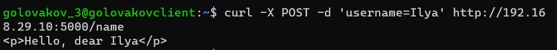

//////////////////////добавление после замечаний////////////
Сделали апгрейд метода PUT, чтобы он тоже принимал параметр.
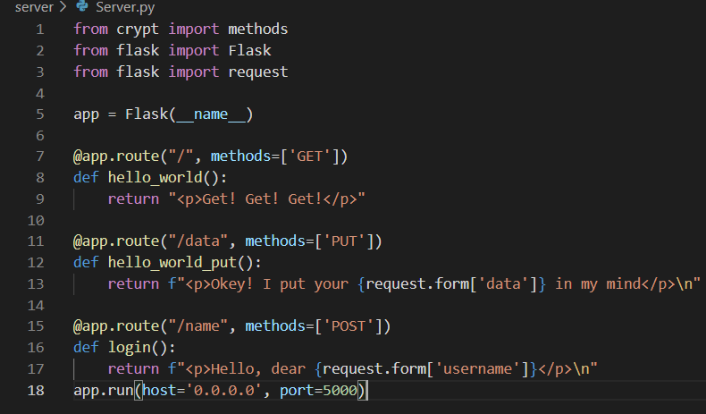

Отправим запрос измененному методу.
```shell
curl -X PUT -d 'data=linux_is_the_best' http://192.168.29.10:5000/data
```
Также сделал tcpdump на шлюзе
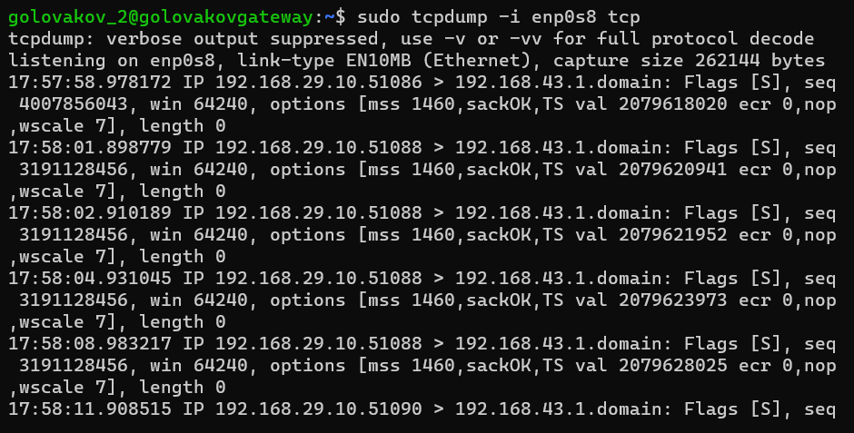
```shell
 sudo tcpdump -i enp0s8 tcp
```
Так как стоит правило на порты, то видим, что длина данных 0 из-за того, что фильтр не пропускает данные с других портов.
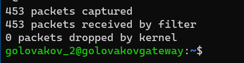
# Заключение
В результате работы была проведена настройка ssh соединения между клиентом и сервером через щлюз. При настройке были созданы правила по передаче пакетов. Также создали http-сервер. В нём создали методы get, put, post. 